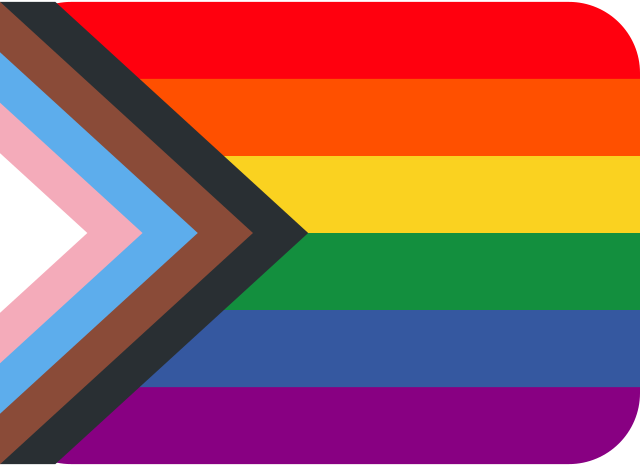

# About me

I am a soon-to-be graduate (June 12th!) from [Utrecht University](https://www.uu.nl/en)'s Master's in [Methodology and Statistics](https://www.uu.nl/en/masters/methodology-and-statistics-behavioural-biomedical-and-social-sciences). My thesis focuses on hyperparameter tuning of random forests, which allowed me to delve deep into machine learning techniques this year. In parallel, I followed the [Applied Data Science track](https://www.uu.nl/en/masters/methodology-and-statistics-behavioural-biomedical-and-social-sciences/tracks), which gives me a breadth of knowledge regarding current data science and machine learning techniques, including, but not limited to, supervised and unsupervised learning, regularisation, deep learning and natural language processing.

Over the past two years, I have also done some teaching and consulting part-time. I have developed course materials and gave statistics classes. I greatly enjoyed this, and would love to continue communicating statistics - whether by explaining methods, findings, or possible research avenues - in the future.

Prior to this, I graduated from the [University of Glasgow](https://www.gla.ac.uk/) with a joint honours Bachelor's in Psychology and Statistics. While I chose to move abroad for my Master's, I have always aimed to come back to Scotland - so that's where I'm looking for a job! I greatly value the impact my work and actions have, which is why I aim to use my knowledge and abilities to help people or the climate. [Get in touch](https://judithneve.github.io/contact.html) if you have an opportunity for me!
  
&nbsp;&nbsp;
