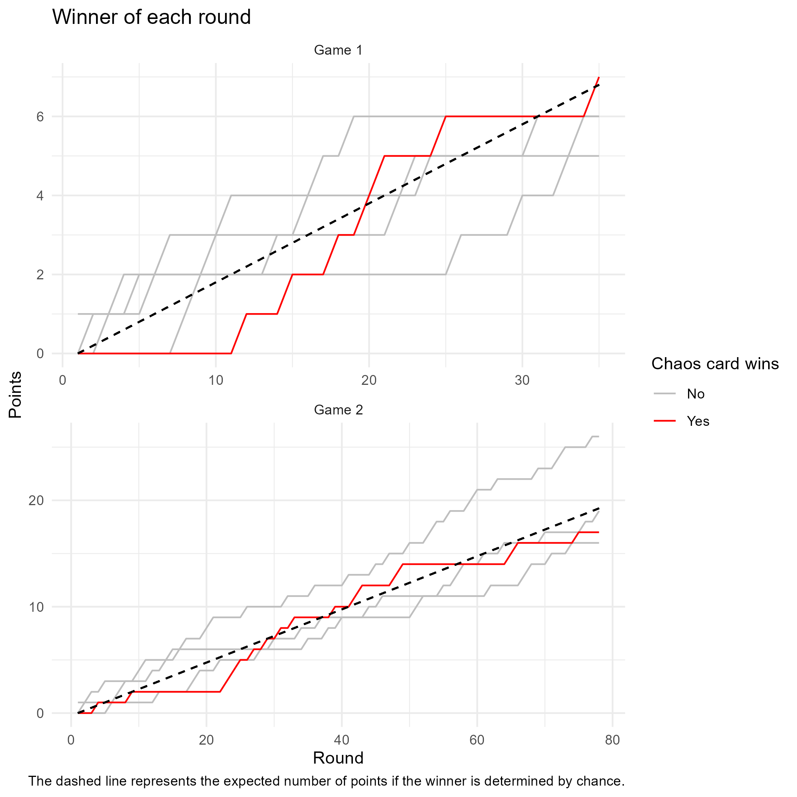

# Projects

## Academic projects

### Master's thesis *[in progress]*

**Title:** Evaluating tuning strategies for random forest hyperparameters with regards to prediction performance of clinical prediction models and computational time.

**Supervisors:** [Dr. Maarten van Smeden](http://mvansmeden.net/) \| Zoe Dunias \| [Dr. Ben van Calster](https://www.universiteitleiden.nl/en/staffmembers/ben-van-calster#tab-1)

I am doing my thesis at Utrecht's University Medical Center's [Julius Centrum](https://juliuscentrum.umcutrecht.nl/en/). My project aims to improve tuning strategies for random forests with a dichotomous outcome, focusing on predictive performance via calibration. I aim to do this in three steps:

1. Identify which hyperparameters have the largest effect on calibration.
2. Identify a metric to optimise.
3. Identify the best hyperparameter search algorithm.

In a world where machine learning is growing exponentially and increasingly adding to carbon emissions, this project also focuses on the computational time of tuning procedures.

[GitHub repository](https://github.com/judithneve/HyperparameterTuning) \| <a href="https://judithneve.github.io/HyperparameterTuningPreliminaryResults.pdf" target="_blank">Report on preliminary results</a>

### Undergraduate dissertation *[completed]*

**Title:** The evolution of data sharing practices in the psychological literature.

**Supervisor:** [Dr. Guillaume Rousselet](https://www.gla.ac.uk/schools/psychologyneuroscience/staff/guillaumerousselet/)

This project focused on evaluating the rate at which data is shared and how it is shared over time. I focused on three journals that have implemented policies regarding data sharing and examined differences before and after policy implementations, as well as computing a baseline data sharing rate using three journals with no policies.

[OSF project](https://osf.io/567vb/) \| [Preprint](https://psyarxiv.com/3xdja)

### Other projects *[completed]*

**Classification algorithm.** I took part in a project aiming to classify mushrooms as edible or poisonous based on a variety of visual characteristics. Multiple algorithms were used and compared.
[GitHub repository](https://github.com/judithneve/Getting-High-or-Die/blob/main/Group1_Assignment2_report.Rmd)

**Gibbs sampler.** In order to deepen my understanding of Bayesian approaches, I have coded the entirety of a Gibbs sampler.
[GitHub repository](https://github.com/judithneve/GibbsSampler)

## Research assistant project

### CTmeta *[completed]*

I worked as a research assistant for [Dr. Rebecca Kuiper](https://www.uu.nl/medewerkers/RMKuiper) from October 2021 to May 2022. In that time, I extensively tested functions from the [CTmeta R package](https://rdrr.io/github/rebeccakuiper/CTmeta/) and edited the documentation.
[GitHub fork](https://github.com/judithneve/CTmeta) \| [Test files](https://github.com/judithneve/testingCTmeta)

## Teaching assistant project

### Grasple lessons *[completed]*

Over summer 2022, I worked on making and updating online statistics lessons on the platform [Grasple](https://www.grasple.com/). These lessons are part of the general part of a mandatory [Advanced Research Methods and Statistics](https://osiris.uu.nl/osiris_student_uuprd/OnderwijsCatalogusSelect.do?selectie=cursus&cursus=201900104&collegejaar=2020&taal=en) course for psychology bachelor students.

## Hobby projects

### \#TidyTuesdays *[on a break]*

I have occasionally taken part in the [#TidyTuesdays](https://github.com/rfordatascience/tidytuesday) challenges, which release a dataset each week and participants create visualisations.
[Code](https://github.com/judithneve/Tidy-Tuesdays)

### Cards Against Humanity *[ongoing]*

In April 2020, after a fair few game nights with the people I was living with under lockdown, we started wondering whether a randomly added card in a [Cards Against Humanity](https://en.wikipedia.org/wiki/Cards_Against_Humanity) round was increasingly likely to win as the game went on. I took it upon myself to start collecting data to test this hypothesis - while my sample size is too small to draw meaningful conclusions so far, the project is ongoing and some visualisations do exist!

[Code](https://github.com/judithneve/CardsAgainstHumanity)
